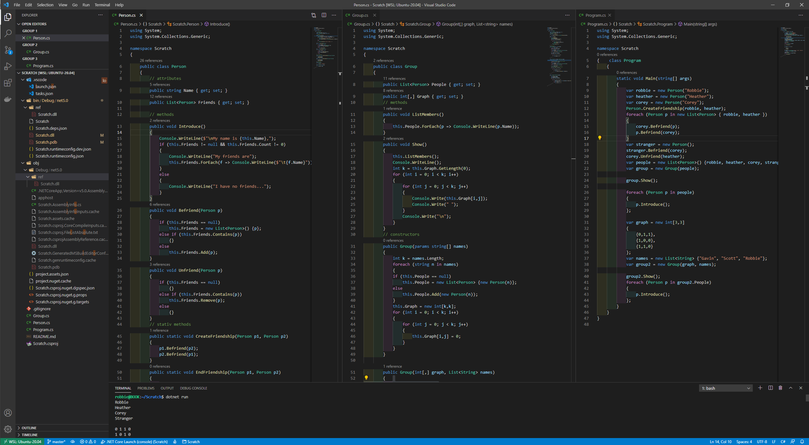

# Friend Machine  
    
Classes to manage friendships between groups,    
People can have one-directional friendships and names,    
Groups can have people and their relationships.     
    
    
  
## Create a random group of size n (randomuser.me API)  
    
```csharp  
var groupTask = Group.GetGroupAsync(10);  
var group = await groupTask;  
group.RandomizeFriendships();  
group.Show();  
group.People.ForEach(p => p.Introduce());  
```  
    
Mr Herman Knight  
Mr Mahmoud Demir  
Mrs Toni Ross  
Mr حسین سالاری  
Mr Salah Tonnaer  
Mr Mario Herrero  
Mr Cristobal Gonzalez  
Miss Dirce Ribeiro  
Ms Valentine Siekmann  
Mr Mustafa Okumuş  
  
× 0 0 1 1 1 0 1 0 0   
0 × 0 0 0 0 1 0 1 0   
0 0 × 0 0 0 0 0 0 0   
1 0 0 × 1 0 0 0 0 1   
1 0 0 1 × 1 0 0 0 0   
1 0 0 0 1 × 0 0 0 0   
0 1 0 0 0 0 × 0 1 0   
1 0 0 0 0 0 0 × 0 0   
0 0 0 0 0 0 1 0 × 0   
0 0 0 1 0 0 0 0 0 ×   
  
My name is Mr Herman Knight,  
My friends are  
        Mr حسین سالاری  
        Mr Salah Tonnaer  
        Mr Mario Herrero  
        Miss Dirce Ribeiro  
  
My name is Mr Mahmoud Demir,  
My friends are  
        Mr Cristobal Gonzalez  
        Ms Valentine Siekmann  
  
My name is Mrs Toni Ross,  
I have no friends...  
  
My name is Mr حسین سالاری,  
My friends are  
        Mr Herman Knight  
        Mr Salah Tonnaer  
        Mr Mustafa Okumuş  
  
My name is Mr Salah Tonnaer,  
My friends are  
        Mr Herman Knight  
        Mr حسین سالاری  
        Mr Mario Herrero  
  
My name is Mr Mario Herrero,  
My friends are  
        Mr Herman Knight  
        Mr Salah Tonnaer  
  
My name is Mr Cristobal Gonzalez,  
My friends are  
        Mr Mahmoud Demir  
        Ms Valentine Siekmann  
  
My name is Miss Dirce Ribeiro,  
My friends are  
        Mr Herman Knight  
  
My name is Ms Valentine Siekmann,  
My friends are  
        Mr Cristobal Gonzalez  
  
My name is Mr Mustafa Okumuş,  
My friends are  
        Mr حسین سالاری  
  
## Create groups one frined at a time   
    
```csharp   
var robbie = new Person("Robbie");   
var heather = new Person("Heather");   
Person.CreateFriendship(robbie, heather);   
heather.Unfriend(robbie)   
```   
    
Robbie    
Heather    
Corey    
Stranger    
    
0 1 1 0     
1 0 1 0     
1 0 0 0     
0 0 1 0     
    
My name is Robbie,    
My friends are    
	Heather    
	Corey    
    
My name is Heather,    
My friends are    
	Robbie    
	Corey    
    
My name is Corey,    
My friends are    
	Robbie    
    
My name is Stranger,    
My friends are    
	Corey    
    
# Create the group and the friendship topology all at once    
    
```csharp   
var graph = new int[3,3]   
{   
	{0,1,1},   
	{1,0,0},   
	{1,1,0}   
};   
var names = new List<String> {"Gavin", "Scott", "Robbie"};   
var group2 = new Group(graph, names);   
group2.Show();   
foreach (Person p in group2.People)   
{   
	p.Introduce();   
};   
```   
    
Gavin    
Scott    
Robbie    
    
0 1 1     
1 0 0     
1 1 0     
    
My name is Gavin,    
My friends are    
	Scott    
	Robbie    
    
My name is Scott,    
My friends are    
	Gavin    
    
My name is Robbie,    
My friends are    
	Gavin    
	Scott    
